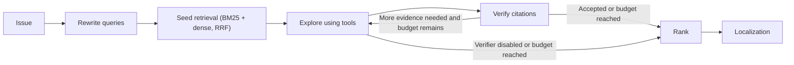

# Issue localization

The agent reads the repository at the issue's base commit. Gold paths and functions are evaluation labels and must be withheld from the agent.

```mermaid
flowchart LR
    I[Issue] --> Q[Rewrite queries]
    Q --> S["Seed retrieval (BM25 + dense, RRF)"]
    S --> E[Explore using tools]
    E --> V[Verify citations]
    V -->|More evidence needed and budget remains| E
    V -->|Accepted or budget reached| R[Rank]
    E -->|Verifier disabled or budget reached| R
    R --> L[Localization]
```
